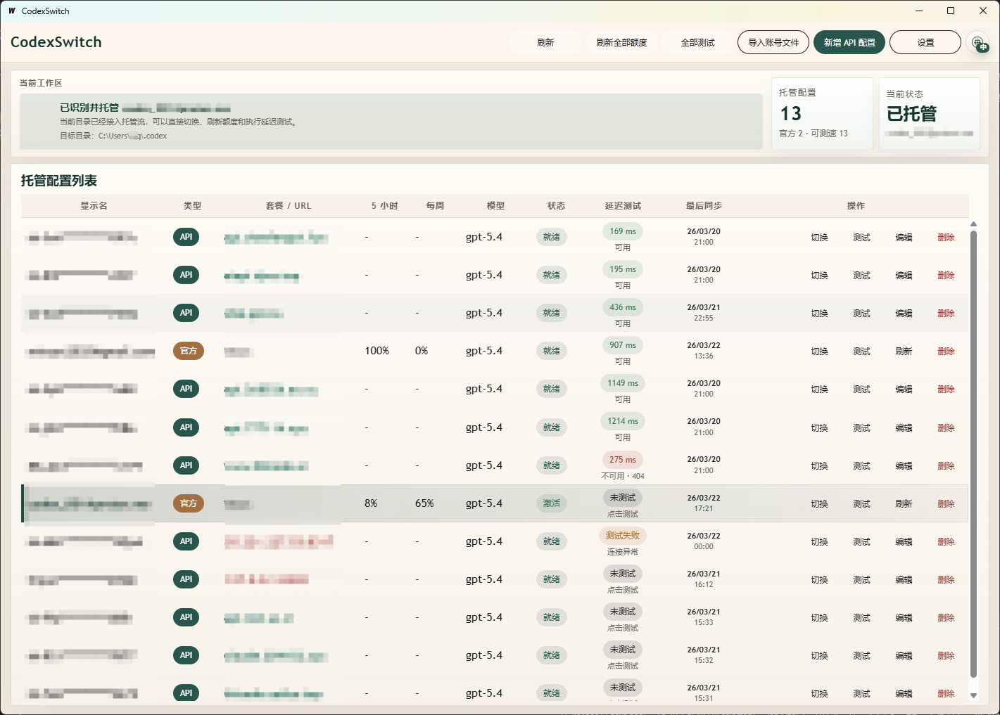

<p align="right">
  <a href="./README.md">简体中文</a> | <strong>English</strong>
</p>

# CodexSwitch

<p align="center">
  <strong>Desktop tool for switching Codex official accounts and OpenAI API profiles</strong>
</p>

<p align="center">
  
  
  
  
  
</p>

<p align="center">
  
  
  
  
</p>

<p align="center">
  <a href="https://github.com/fangxielian0116/CodexSwitch/releases"></a>
  <a href="https://github.com/fangxielian0116/CodexSwitch/stargazers"></a>
  <a href="https://github.com/fangxielian0116/CodexSwitch/issues"></a>
</p>

<p align="center">
  <a href="https://github.com/fangxielian0116/CodexSwitch/releases">Download release builds</a>
</p>

CodexSwitch is a cross-platform desktop app for managing multiple Codex official accounts and custom OpenAI API profiles. It connects the Codex home directory you are actively using with a local managed profile library, so you can switch between accounts, API keys, models, and reasoning settings without repeatedly editing `auth.json` and `config.toml`.

> This repository continues and extends the original [ke4nec/CodexSwitch](https://github.com/ke4nec/CodexSwitch) project. Thanks to the original author for the foundation, product direction, and open-source implementation.

## Preview

<p align="center">
  
</p>

## What's Updated In This Repository

This version focuses on more reliable profile switching and clearer account status visibility:

- **Unified management for official and API profiles**
  Detect the current Codex directory, import official account files, create or edit API profiles, and manage profiles from different sources in one local list.

- **Support for standard official auth files and CLI auth files**
  Official account import supports standard `auth.json` files and CLI-style auth files containing fields such as `access_token`, `refresh_token`, and `account_id`. CLI files are normalized into a Codex-compatible structure.

- **Improved API profile generation**
  API profile creation generates complete `auth.json` and `config.toml` files. It supports `Base URL`, model, reasoning effort, context window, and automatically computes `model_auto_compact_token_limit`.

- **Protect current config before switching**
  Before switching to another profile, the app scans and stores the valid config currently in the Codex directory to reduce the risk of overwriting an active account or API setup.

- **More stable `config.toml` write-back**
  Official accounts share an official config template. When switching API profiles, or switching back from API to an official account, managed config is merged with the existing target config where possible.

- **Official account limit refresh**
  Official accounts can refresh usage limits. The app parses 5-hour and weekly windows, stores plan type, reset time, and refresh state, and tries to refresh the official access token before fetching limits.

- **Latency and availability testing**
  Official and API profiles can be tested individually or in bulk. API profiles test basic connectivity and then validate availability through `/responses` or `/chat/completions` depending on `wire_api`.

- **API connectivity history**
  API latency and availability results are persisted in a local SQLite database. Up to 48 entries are kept per profile and displayed as recent connectivity markers in the UI.

- **Sorting and status visibility**
  The profile list can be sorted by 5-hour remaining quota, weekly remaining quota, latency, and last sync time. It also shows active, disabled, invalid, and ready states.

- **System tray and quick switching**
  The tray menu shows the current profile and provides open-window, quick-switch, and quit actions. On Windows, the close button can hide the window to the tray when enabled in settings.

- **Restart Codex after switching**
  A setting can request a Codex restart after a successful switch. The current implementation supports Windows and macOS.

- **Windows network repair**
  The Windows network repair action runs with administrator permission, adjusts IPv4 metrics for physical and VPN/virtual adapters, clears the DNS cache, and checks reachability for `api.openai.com` and `chatgpt.com`.

- **Local maintenance**
  Profiles can be enabled, disabled, and deleted when not active. The app can also clean expired archived sessions from the target Codex directory based on a configurable retention period.

- **Chinese and English UI**
  The app includes Chinese and English UI text and remembers the selected language.

## Use Cases

- Switch between multiple Codex official accounts
- Manage official accounts and multiple OpenAI API keys together
- Keep separate profiles for different models, Base URLs, and reasoning settings
- Check official account limits, API availability, and latency quickly
- Avoid manual edits to `~/.codex/auth.json` and `~/.codex/config.toml`

## Typical Workflow

1. Launch CodexSwitch.
2. Open Settings and confirm the target Codex config directory, usually `~/.codex` or `%USERPROFILE%\.codex`.
3. Let the app detect the current profile automatically, or import an official account file.
4. Add API profiles as needed by entering Base URL, model, reasoning effort, context window, and API key.
5. Use the managed profile list to switch, test, refresh limits, disable, or delete profiles.
6. Optionally enable "Restart Codex after switching" or "Hide to tray on close" in Settings.

## Common Codex Config Directories

- Windows: `%USERPROFILE%\.codex`
- macOS: `~/.codex`
- Linux: `~/.codex`

The target path can be changed manually in Settings. After saving settings, the app immediately rescans the directory and detects the active profile.

## Data And Security Notes

- Managed profiles are stored in the local app config directory and are not uploaded to the cloud by CodexSwitch.
- API keys and official account tokens are stored locally in the managed profile library. Do not upload the app config directory to a public repository.
- Deleting a managed profile only removes CodexSwitch's local managed copy. It does not proactively clear the target Codex directory.
- The currently active profile cannot be deleted directly. Switch to another profile first.

## Download And Releases

The release workflow is defined in [`.github/workflows/release-cross-platform.yml`](.github/workflows/release-cross-platform.yml) and builds assets for:

- Linux `amd64`
- Windows `amd64`
- macOS `amd64`
- macOS `arm64`

The version is read from `info.productVersion` in [`wails.json`](wails.json). The recommended release path is to push a version tag:

```bash
git tag v1.0.3
git push origin v1.0.3
```

The workflow can also be triggered manually. Branch-based release triggering currently listens for [`wails.json`](wails.json) changes on `master`; if your default branch is `main`, use a tag or manual dispatch, or update the workflow branch configuration.

## Build From Source

### Requirements

- Go `1.26+`
- Node.js `22.x`
- Wails CLI `v2.11.0+`

Install the Wails CLI:

```bash
go install github.com/wailsapp/wails/v2/cmd/wails@latest
```

### Bootstrap Dependencies

```cmd
bootstrap.bat
```

### Development

```cmd
dev.bat
```

### Local Build

```cmd
build.bat
```

### Local Release Build

```cmd
release.bat
```

### Clean Build Output

```cmd
clean.bat
```

Remove all generated files including `node_modules`:

```cmd
clean.bat -All
```

## Manual Commands

If you prefer running commands directly:

```bash
cd frontend
npm install
npm run build
cd ..
go test ./...
go build ./...
wails build
```

## Tech Stack

- **Backend**: Go
- **Desktop Shell**: Wails v2
- **Frontend**: Vue 3 + TypeScript + Vuetify + Pinia
- **Local Storage**: JSON files + SQLite
- **Build And Release**: GitHub Actions

## Project Structure

- [`app.go`](app.go): Wails bindings that connect frontend actions with backend services
- [`internal/codexswitch`](internal/codexswitch): core logic for scanning, import, switching, limit refresh, latency testing, and settings storage
- [`frontend`](frontend): Vue desktop UI, state management, and bilingual messages
- [`docs/preview.png`](docs/preview.png): README preview image
- [`.github/workflows/release-cross-platform.yml`](.github/workflows/release-cross-platform.yml): cross-platform release workflow

## Current Limitations

- Network repair currently supports Windows only.
- Restarting Codex after switching currently supports Windows and macOS. Linux returns an unsupported message.
- Official limit refresh and latency testing depend on ChatGPT/Codex-related endpoints being reachable. Endpoint changes may affect results.
- API availability testing sends one lightweight request with the prompt `hi`.

## Acknowledgements

Thanks to the original author of [ke4nec/CodexSwitch](https://github.com/ke4nec/CodexSwitch) for the project foundation and open-source implementation. This repository continues that work by improving account import, API profiles, limit refresh, latency testing, tray experience, network repair, and automated releases.

Thanks also to Wails, Go, Vue, Vuetify, Pinia, SQLite, and the broader open-source ecosystem.
